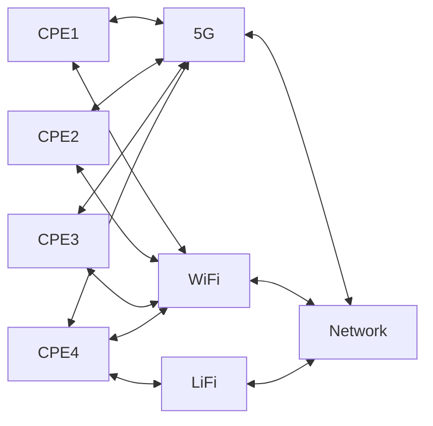

# Open-Source Data for Multi-Domain Network Monitoring and Sensing in Optical and Wireless Networks

## One-month Performance Monitoring Data from Optical Networks over NDFF

## Two-week Sensing Data from BDFI and Mshed

A two-week fibre-sensing campaign was conducted using a bidirectional transmission configuration, where state-of-polarization (SoP) sensing was employed to monitor the fibre link between 19 September and 8 October 2025. A section of the link passes beneath a railway track. An ADVA Teraflex transponder launches optical carriers into circulators to enable counter-propagating transmission, with endpoint Circulators 1 and 2 interconnected through the live field fibre. Each circulator output is divided by a coupler: 90\% of the optical power is directed to the coherent receiver, while the remaining 10\% passes through a polarizer to enforce single-polarization and to project the RSOP onto the eigenstate of polarizer before being delivered to a polarimeter (EPS PM1000) and a real-time oscilloscope (Tektronix MSO64B) equipped with a photodetector for sensing. For vibration localization, an arbitrary waveform generator (Rigol DG4102) supplies a common trigger to both instruments, constraining inter-instrument timing skew to the nanosecond scale. The transmitted signal is 32-GBaud PM-QPSK; the forward and backward channels are centered at 193.4 THz and 191.3 THz respectively, with bidirectional operation over 7.776 km (MVB-BDFI) and 8 km (MVB-M Shed) of urban fibres. Along the BDFI route, the fibre passes beneath multiple railway tracks near Bristol Temple Meads Station at the 3.2-km point, where it traverses laterally beneath a railway bridge. On the automation side, our ISIC end-to-end monitoring platform continuously tracks communication KPIs, like BER, Q-factor, QSNR, received power, etc., and polarisation telemetry (Stokes parameters), with real-time storage and analytics. We collected data with a time span of 2 weeks, in the formats of mat and CSV. The data collected by the Polarimeter includes the collection time, S1, S2, and S3 data. Sampling rate: 97656.250 Hz (Ts = 1.024e-05 s). The data collected by the DSO is the collection time and the voltage value.

## Wireless Access Network Dataset

This dataset is collected from a multiple radio access technologies testbed, the network architecture is as the figure shown.

There are four CPEs in the network. CPE1,CPE2,CPE3 are connected to both 5G and WIFI access point. CPE4 is connected to 5G ,WIFI and Lifi access point. MPTCP is enabled in all CPEs. 

The MPTCP path manager is fullmesh: it will try to create an additional subflow for each known peer address, using this endpoint as the source IP address. And the MPTCP implements a simplified version of the BLEST algorithm as its scheduler, trying to avoid HoL blocking. It sends as much as possible over the active path, before using the others. 

Traffic is transmitted from CPE1,CPE2,CPE3 to CPE4 using iperf with MPTCP enabled. And the dataset contains the parameters recored in all access points and all CPEs during the transmission.

### MAC Address and Interface for Each CPE
| CPE | Wifi MAC Address      | Lifi MAC Address      | 5G Interface | Wifi Interface      | Lifi Interface       |
| --- | --------------------- | --------------------- | ------------ | ------------------- | -------------------- |
| 1   | c8:3a:35:a0:05:fd      | None                  | wwan0        | wlxc83a35a005fd      | None                 |
| 2   | c8:3a:35:a4:07:0d      | None                  | wwan0        | wlxc83a35a4070d      | None                 |
| 3   | c8:3a:35:ac:04:5d      | None                  | wwan0        | wlxc83a35ac045d      | None                 |
| 4   | c8:3a:35:a4:06:9d      | 00:c0:ca:b5:c6:77     | wwan0        | wlxc83a35a4069d      | wlx00c0cab5c677       |

A [24-hour dataset](https://github.com/hpn-bristol/Open-Source-Data-for-Multi-Domain-Network-Optimisation-and-Sensing-in-Optical-Networks-and-WANs/tree/main/WAN_24h) including the raw data and processed data is generated. For your infomation, we also provide the [raw data preprocessing code](https://github.com/hpn-bristol/Open-Source-Data-for-Multi-Domain-Network-Optimisation-and-Sensing-in-Optical-Networks-and-WANs/blob/main/WAN_24h/process_data.ipynb).

### Parameters Included in Dataset

#### 1. CPE Data

CPEs Included: CPE1, CPE2, CPE3, CPE4

Each CPE file includes the following metrics:
- `recv [interface]`: Data received on specified interface
- `trans [interface]`: Data transmitted on specified interface

#### 2. 5G Cell Data

The 5G cell dataset encompasses:
- **Temperature Sensor Readings**: Monitors the temperature of the 5G cell equipment.
- **Uplink/Downlink Throughput Measurements**: Measures the data throughput in both uplink and downlink directions.
- **RMOD Power**: Reflects the power consumption or output in the Radio Modulation units.

#### 3. LiFi Cell Data

Data concerning LiFi technology includes:
- **Transmitted (Tx) / Received (Rx) Bitrates**: Measures the bitrates transmitted to and received from each CPE by the LiFi access point, identified by MAC address.
- **Signal Power**: Indicates the power of the signal at the LiFi access point for various CPEs.

#### 4. WiFi Cell Data

WiFi data metrics are as follows:
- **Inactivity Time**: Tracks the periods of inactivity of each CPE.
- **Transmitted (Tx) / Received (Rx) Bitrates**: Documents the bitrates that the WiFi access point transmits to and receives from each CPE, identified by MAC address.
- **Signal Averages**: Captures the average signal levels at the WiFi access point for different CPEs.

#### Additional Notes:
- Each file in LiFi and WiFi cell data corresponds to a specific CPE, identified by MAC address. The data is presented from the perspective of the access points, such as the amount of data transmitted to and received from each CPE by the access points, and the signal strength detected for each CPE at the access points.

## 🙌Acknowledgment

This work was partly supported by the **European Commission’s Horizon research and innovation program: Allegro project (No. 101092766)** and the **EU-funded project ECO-eNET (No. 10113933)**.

If you use optical data from this repository in your research, please cite the following paper:
 
> "**S. Shen et al., "Unified monitoring and telemetry platform supporting network intelligence in optical networks," in Journal of Optical Communications and Networking, vol. 17, no. 2, pp. 139-151, February 2025, doi: 10.1364/JOCN.538552.**"  
> [[https://doi.org/10.1364/JOCN.538552](https://ieeexplore.ieee.org/document/10856707)]

 

## 📧Contact Information
If you have any questions regarding the dataset or want to have some collaborations, please feel free to contact:

Dr. Shuangyi Yan: shuangyi.yan@bristol.ac.uk (Team Leader & Project Manager)

Dr. Sen Shen: sen.shen@bristol.ac.uk (Optical Networks & Sensing)

Miss. Xueqing Zhou: xueqing.zhou@bristol.ac.uk (Wireless/Radio Access Networks)

Miss. Wanxin Zhao: wanxin.zhao@bristol.ac.uk (Optical Networks & Sensing)
